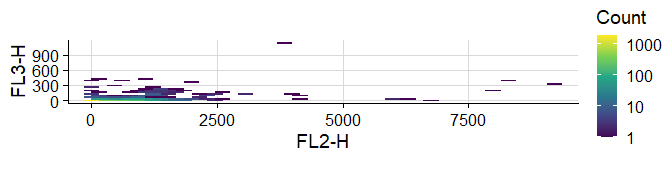
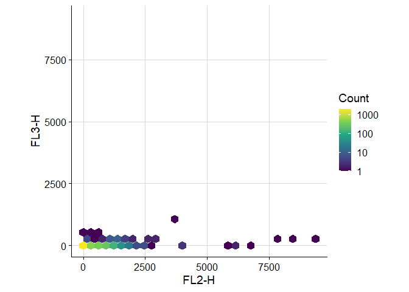
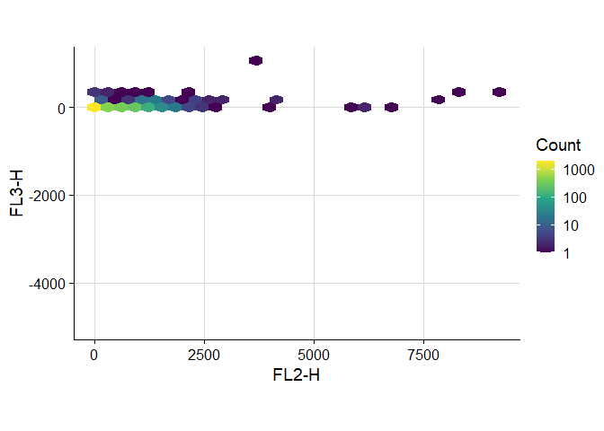

<!-- README.md is generated from README.Rmd. Please edit that file -->

# UtilsCytoRSV

<!-- badges: start -->
<!-- badges: end -->

The goal of `UtilsCytoRSV` is to facilitate common data processing and
visualisation tasks regarding cytometry data (with CyTOF and flow in
mind).

## Installation

You can install `UtilsCytoRSV` from [GitHub](https://github.com/) with:

``` r
if (!requireNamespace("remotes", quietly = TRUE)) install.packages("remotes")
remotes::install_github("SATVILab/UtilsCytoRSV")
```

## Examples

``` r
library(UtilsCytoRSV)
```

### Calculation.

Subtract background.

``` r
.data_test <- data.frame(
pid = rep(c("a", "b"), each = 3),
stim = c("mtb", "ebv", "uns") %>%
  c("uns", "ebv", "mtb"),
resp1 = 1:6,
resp2 = 17:12 * 2
)
data_out <- subtract_background(
 .data = .data_test,
 grp = "pid",
 stim = "stim",
 uns = "uns",
 resp = c("resp1", "resp2"),
 remove_uns = FALSE
)
#> [1] "resp1"
#> [1] "resp2"
```

Sum over marker(s).

``` r
data("data_count")
data_test <- data_count %>%
  calc_prop(den = "count_pop_den",
            num = "count_pop_num") %>%
  dplyr::select(-c(count_pop_den, count_pop_num)) %>%
  dplyr::arrange(SubjectID, VisitType, stim, cyt_combn)

data_out <- sum_over_markers(
  .data = data_test,
  grp = c("SubjectID", "VisitType", "stim"),
  cmbn = "cyt_combn",
  markers_to_sum = c("IFNg", "IL2", "IL17"),
  levels = c("-", "+"),
resp = "prop"
)
```

### Plotting

It provides a 2D hex plot with useful defaults.

``` r
library(UtilsCytoRSV)
suppressWarnings(data("GvHD", package = "flowCore"))
ex_tbl <- flowCore::exprs(GvHD[[1]]) %>%
  tibble::as_tibble()
marker <- c("FL2-H", "FL3-H")
plot_cyto(
  data = ex_tbl,
  marker = marker
)
```



The ranges can be made equal between the x- and y-axes.

``` r
plot_cyto(
  data = ex_tbl,
  marker = marker,
  limits_equal = TRUE
)
```



Each axis can be forced to include particular values (especially useful
if viewing gated data, which may have only positive-expressing cells and
you then want to show that there are no negative-expressing cells).

``` r
plot_cyto(
  data = ex_tbl,
  marker = marker,
  limits_expand = list(y = -5e3)
)
```



#### Utilities

You can get a vector to label channels based on the FCS file using
`chnl_lab`, and then supply this to `plot_cyto` to have better axis
labels. Note that the inverse function, `marker_lab`, is also available
to convert from markers to channels.

``` r
chnl_lab <- chnl_lab(GvHD)
plot_cyto(
  data = ex_tbl,
  marker = marker,
  lab = chnl_lab,
  limits_equal = TRUE
)
```


