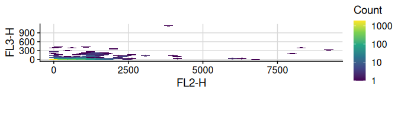
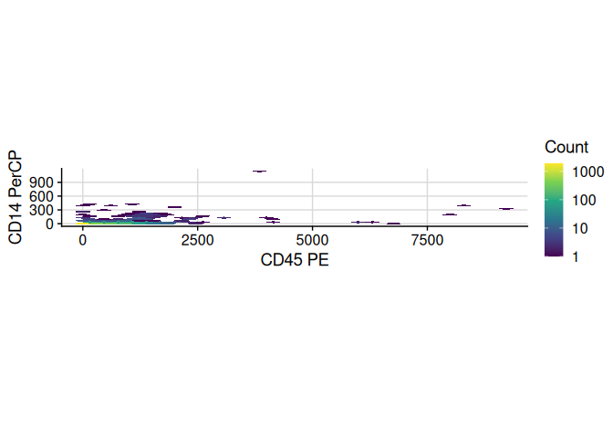

<!-- README.md is generated from README.Rmd. Please edit that file -->

# UtilsCytoRSV

<!-- badges: start -->

[](https://github.com/SATVILab/UtilsCytoRSV/actions/workflows/R-CMD-check.yml)
[](https://app.codecov.io/gh/SATVILab/UtilsCytoRSV?branch=main)

<!-- badges: end -->

`UtilsCytoRSV` is an R package that provides utility functions for
working with cytometry data, including CyTOF (mass cytometry) and flow
cytometry. The package offers tools for:

- **Visualization**: Creating publication-ready 2D hex plots with
  sensible defaults for cytometry data
- **Data Processing**: Background subtraction and marker aggregation for
  cytometry analysis workflows
- **Calculations**: Computing frequencies and proportions from cell
  counts
- **Channel/Marker Utilities**: Converting between channel names and
  marker names from FCS files

## Installation

You can install `UtilsCytoRSV` from
[GitHub](https://github.com/SATVILab/UtilsCytoRSV) with:

``` r
if (!requireNamespace("remotes", quietly = TRUE)) install.packages("remotes")
remotes::install_github("SATVILab/UtilsCytoRSV")
```

## Examples

``` r
library(UtilsCytoRSV)
```

### Visualization

#### Basic Plotting with `plot_cyto()`

The `plot_cyto()` function provides 2D hex plots with useful defaults
for cytometry data.

``` r
suppressWarnings(data("GvHD", package = "flowCore"))
ex_tbl <- flowCore::exprs(GvHD[[1]]) |>
  tibble::as_tibble()
marker <- c("FL2-H", "FL3-H")
plot_cyto(
  data = ex_tbl,
  marker = marker
)
```



Additional options include:

- `limits_equal = TRUE`: Make the ranges equal between the x- and y-axes
- `limits_expand`: Force axes to include particular values (useful for
  gated data)
- `coord_equal`: Make axis units visually equal (default is `TRUE`)

#### Channel/Marker Labeling with `chnl_lab()` and `marker_lab()`

You can get a vector to label channels based on the FCS file using
`chnl_lab()`, and then supply this to `plot_cyto()` to have better axis
labels. The inverse function `marker_lab()` converts from markers to
channels.

``` r
lab_vec <- chnl_lab(GvHD)
plot_cyto(
  data = ex_tbl,
  marker = marker,
  lab = lab_vec
)
```



### Data Processing

#### Background Subtraction with `subtract_background()`

Subtract the unstimulated measurement from one or more response columns.

``` r
data_test <- data.frame(
  pid = rep(c("a", "b"), each = 3),
  stim = c("mtb", "ebv", "uns") |>
    c("uns", "ebv", "mtb"),
  resp1 = 1:6,
  resp2 = 17:12 * 2
)
data_out <- subtract_background(
  .data = data_test,
  grp = "pid",
  stim = "stim",
  uns = "uns",
  resp = c("resp1", "resp2"),
  remove_uns = FALSE
)
#> [1] "resp1"
#> [1] "resp2"
```

#### Summing Over Markers with `sum_over_markers()`

Sum proportions or frequencies over specified markers.

``` r
data("data_count")
data_test <- data_count |>
  calc_prop(
    den = "count_pop_den",
    num = "count_pop_num"
  ) |>
  dplyr::select(-c(count_pop_den, count_pop_num)) |>
  dplyr::arrange(SubjectID, VisitType, stim, cyt_combn)

data_out <- sum_over_markers(
  .data = data_test,
  grp = c("SubjectID", "VisitType", "stim"),
  cmbn = "cyt_combn",
  markers_to_sum = c("IFNg", "IL2", "IL17"),
  levels = c("-", "+"),
  resp = "prop"
)
```

### Calculations

#### Frequencies and Proportions with `calc_freq()` and `calc_prop()`

Calculate frequencies (percentage) or proportions from numerator and
denominator columns.

``` r
mock_data <- tibble::tibble(
  pop = "cd4",
  cd4 = rnorm(10, mean = 2000, sd = 100),
  ifng = rnorm(10, mean = 500, sd = 20)
)
# Calculate frequency (percentage)
calc_freq(
  .data = mock_data,
  den = "cd4",
  num = "ifng"
)
#> # A tibble: 10 × 4
#>    pop     cd4  ifng  freq
#>    <chr> <dbl> <dbl> <dbl>
#>  1 cd4   2083.  477.  22.9
#>  2 cd4   2013.  519.  25.8
#>  3 cd4   1975.  492.  24.9
#>  4 cd4   1971.  526.  26.7
#>  5 cd4   2051.  501.  24.4
#>  6 cd4   2021.  492.  24.3
#>  7 cd4   2036.  495.  24.3
#>  8 cd4   2030.  518.  25.5
#>  9 cd4   2095.  463.  22.1
#> 10 cd4   2016.  497.  24.7
```
